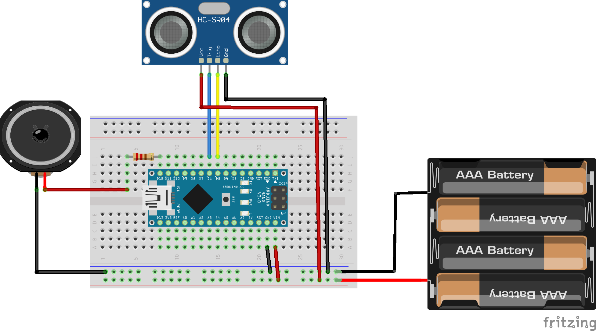

== Monitor Posture

Simple project to detect a bad sitting posture by measuring the distance
from the chair to the user.

As development environment I used https://code.visualstudio.com/[VS Code^] and the Platform IO extension.

.Breadboard connections

